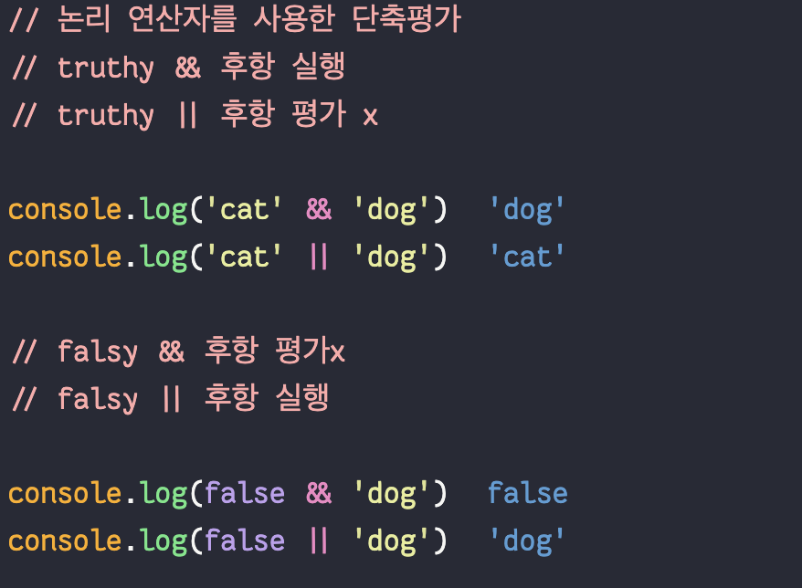
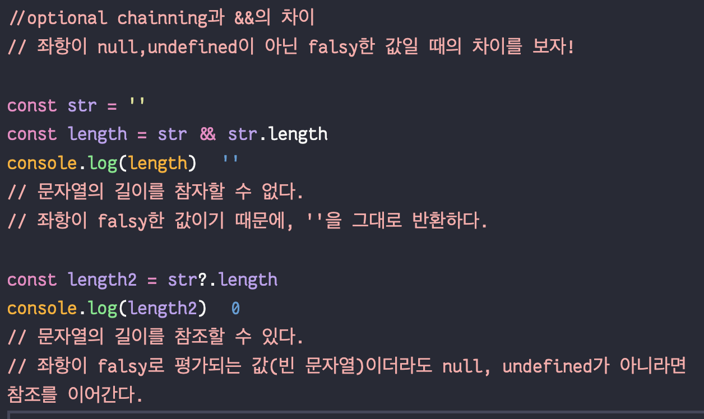
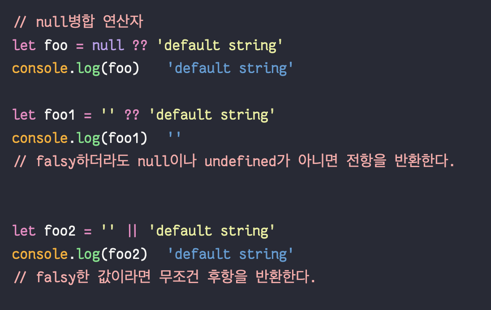

# 타입변환과 단축평가

- 암묵적 타입변환(강제 타입 변환): 자바스크립트 엔진에 의해 암묵적으로 타입이 자동으로 변환되는것
- 명시적 타입변환(타입캐스팅) : 개발자가 의도적으로 타입을 변환시키는 것

## 암묵적 타입변환

## 명시적 타입변환

1. 문자열 타입으로 변환

- `String()`
- `Object.prototype.toString()`
- 문자열 연결 : `+ ''`

2. 숫자 타입으로 변환

- `Number()`
- `parseInt()` , `parseFloat()`
- 산술 연산자이용

```
+ '0'  // 0
+ '10.53' //10.53
+ true //1
+ false // 0
 '0' * 1 // 0
 '-1' * 1 // -1
```

3. boolean타입으로 변환

- `Boolean()`
  빈 객체, 빈 배열의 boolean타입은 **true**이다

```
Boolean(undefined) //false
Boolean('') //false
Boolean({}) //✅true
Boolean([]) //✅true
```

- `!!` : 부정논리연산자를 두번 사용하기

## 🌟**단축평가**



즉, 어떤 값이 truthy일때 무언가를 하려면 && 연산자를  
어떤 값이 falsy일때 무언가를 하려면 || 연산자를 사용한다.

### 사용예시

1. 객체를 가리키기를 기대하는 변수가 null 또는 undefined인지 확인하고 프로퍼티를 참조할 때

```
let element = null
//let value = element.value // 🚨 cannot read property of null
let better_value = element && element.value
```

2. 함수 매개변수에 기본값을 설정할 때

```
function getStringLength(str = ''){
  return str.length
}

function getStringLength2(str){
  str= str || ''
  return str.length
}
```

## 옵셔널 체이닝

`?.` 연산자는 좌항이 undefined이거나 null인경우 undefined를 반환하고 아니면 프로퍼티 참조를 이어간다.

옵셔널 체이닝 연산자가 도입되기 전에는 &&를 이용한 단축평가를 통해 null, undefined인지 확인했다.



## null 병합 연산자

`??`은 좌항이 null, undefined일때 우항을 반환한다.

이 연산자는 변수에 기본값을 설정할 때 유용하다.

null병합 연산자가 도입되기 전에는 ||을 이용한 단축평가를 통해 변수에 기본값을 설정했다.


